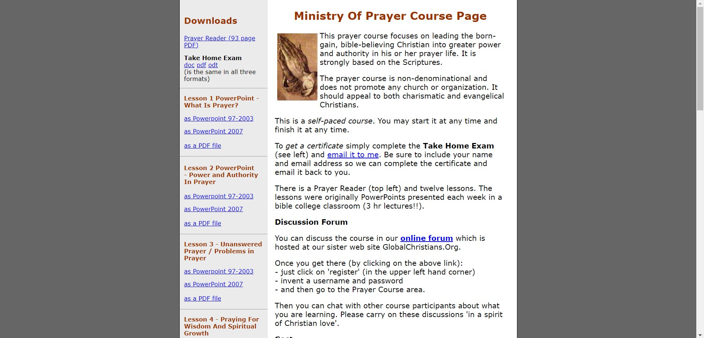
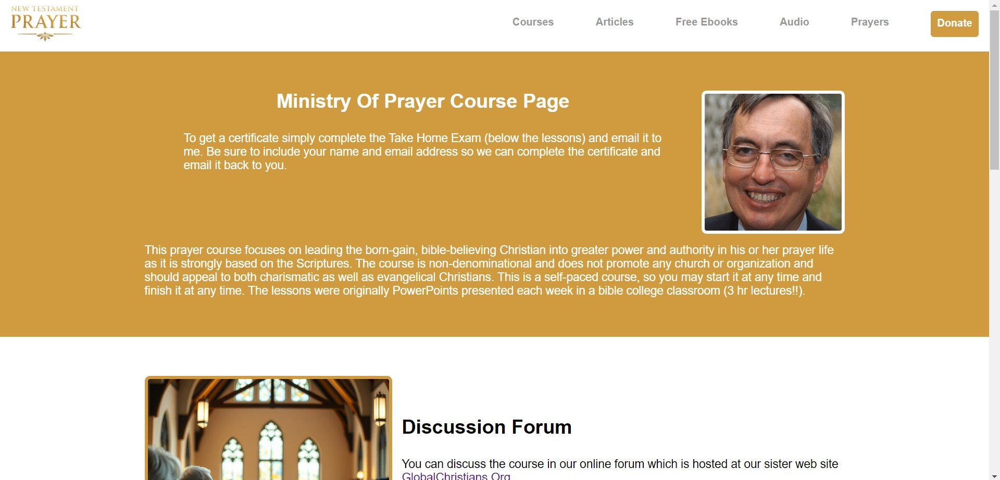
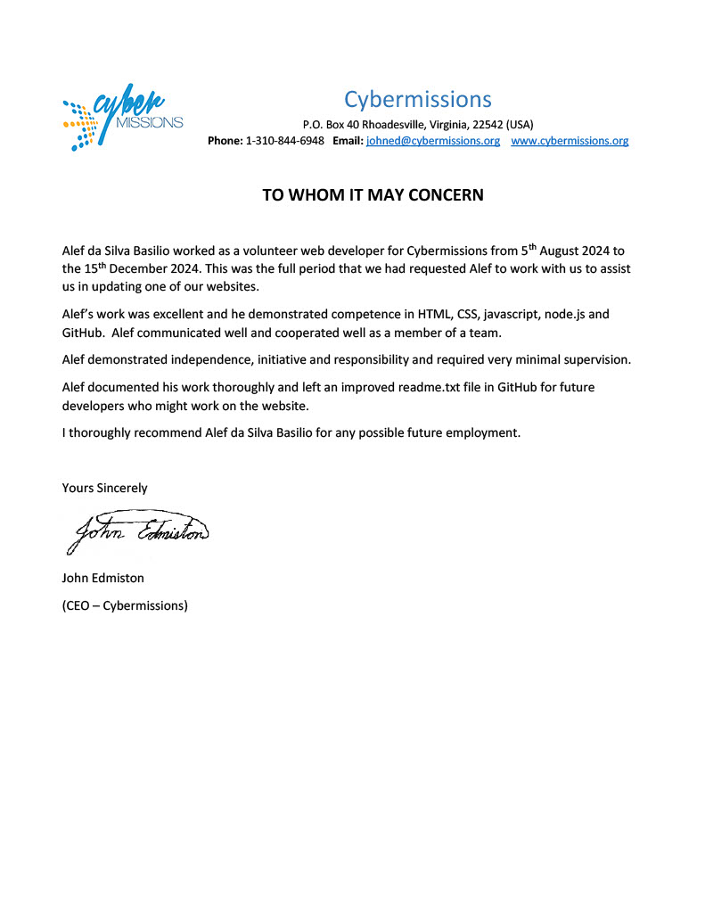

<h1 align="center" style="font-weight: bold;">Professional experiences</h1>
<h2>Full-stack web developer volunteer at Cybermissions</h2>
09/2024 – 12/2024 - remote
  
• JavaScript, Sass, Gulp.js, Git, HTML and CSS. 
• I received a Formal Reference on Cybermissions Letterhead (see below). 
• Cybermissions is a Virginia (USA) non-profit organization 501(c)(3) that provides training and religious
content for underprivileged people since 2001 to over 1.2 million users and 150 countries annually. 
• I updated the organization's Ntprayercom website weekly: interfaces, features and server, increasing the project deployment from 14% to 42%. 
• Leadership: although it was my first professional experience, I needed to define work
methodologies with other people. To do this, I used knowledge acquired in courses with more
experienced programmers.

<h3>Example</h3>
Before

  

    
  

  

    
  

After

  

    
  

<h3>Formal Reference on Cybermissions Letterhead</h3>

  

    
  

