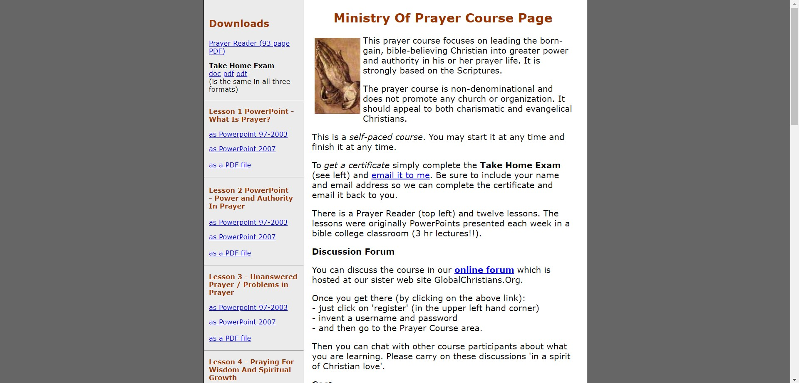

<h1 align="center" style="color: #805ad5; font-weight: bold;">Professional experiences</h1>
<h2>Volunteer</h2>
Cybermissions 
09/2024 – current - remote
  
• JavaScript, Sass, Gulp.js, Git, HTML and CSS. 
• Cybermissions is a Virginia (USA) non-profit organization that provides training and religious
content for underprivileged people. 
• I update the organization's websites weekly: the interfaces, functionalities and server. 
• Leadership: although it was my first professional experience, I needed to define work
methodologies with other people. To do this, I used knowledge acquired in courses with more
experienced programmers.

<h3>Example</h3>
Before

  

    
  

After

  

    
  

